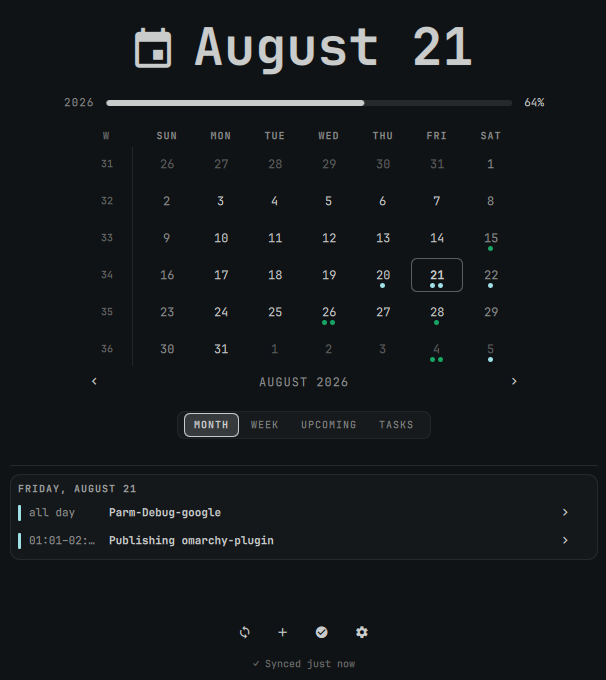
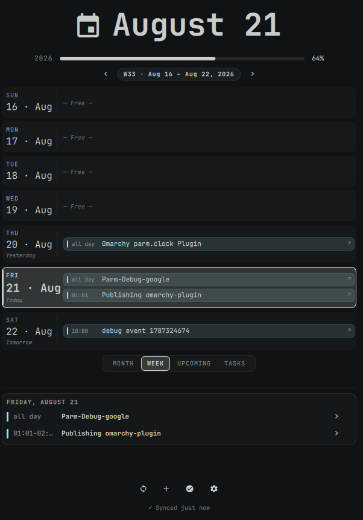
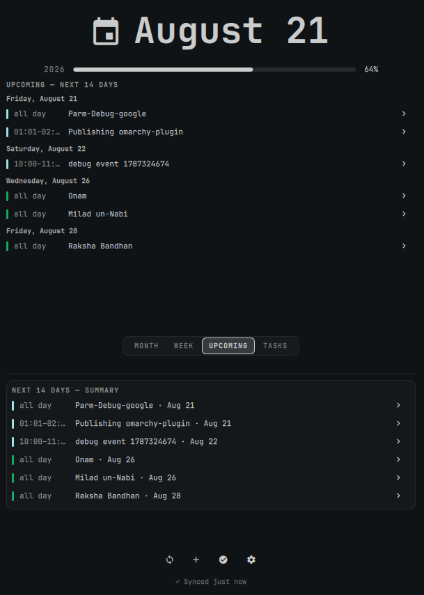
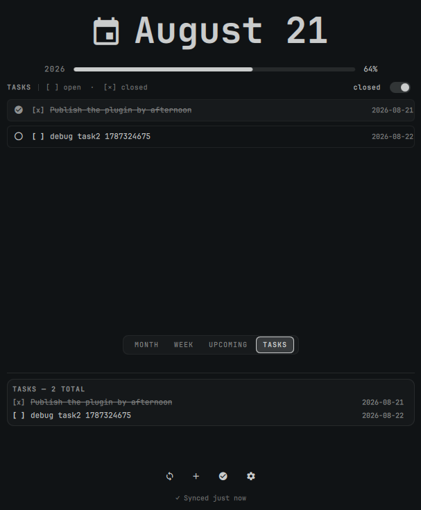
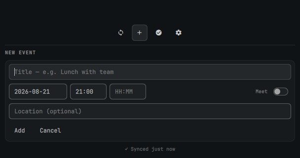
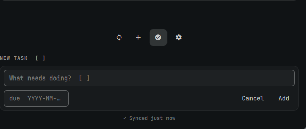
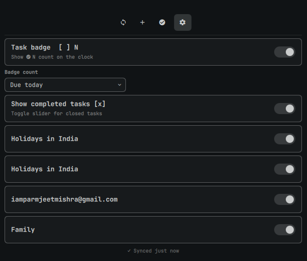

# Google Calendar Clock — `parm.clock`

An [Omarchy](https://omarchy.org/) bar widget: a clock whose calendar popup shows **your Google Calendar events and Google Tasks** — dots on the month grid, an agenda list, a task badge on the bar, and full create/edit/delete for events and tasks.

It is a clone of the built-in `omarchy.clock` (the same date/time label, calendar popup, month stepping, week-start toggle, and memento-mori bars), with Google Calendar + Tasks layered on top.

> **Repository:** https://github.com/iamparmjeet/omarchy-google-calendar-clock  
> **Plugin ID:** `parm.clock` · **Category:** Time · **Kind:** `bar-widget`

---

## Preview

| Month — dots for every day with events | Week — 7-day vertical agenda | Upcoming — next 14 days |
|---|---|---|
|  |  |  |

| Tasks — filter open/closed | New Event form | New Task form | Settings — calendars & badge |
|---|---|---|---|
|  |  |  |  |

**What you see in the screenshots:**

- **Month** (`MONTH` pill): 6-row month grid with ISO week numbers (W), week-start toggle, month stepping `‹ ›`, and coloured dots per day (up to 4 event dots tinted by calendar colour, plus one accent dot when tasks are due). Selected day is highlighted; today has a border. Bottom card shows the agenda for `FRIDAY, AUGUST 21` plus any tasks due that day.
- **Week** (`WEEK` pill): Header `W33 · Aug 16 — Aug 22, 2026` with `‹ ›` stepping. Each day is a full-width row with date rail (`16 · Aug` + `Today`/`Tomorrow`/`Yesterday`) and up to 3 event chips (`all day`/`HH:MM` + title). Free days show `— Free —`.
- **Upcoming** (`UPCOMING` pill): `UPCOMING — NEXT 14 DAYS` grouped by date, plus `NEXT 14 DAYS — SUMMARY` card at the bottom.
- **Tasks** (`TASKS` pill): Header `TASKS [ ] open · [x] closed` with `closed` toggle. Each task has `[ ]`/`[x]` checkbox, title, `due YYYY-MM-DD`/`no due`, and delete. Stale toggle is off by default (only open tasks).
- **New Event** (`+` button): Fields `Title`, `YYYY-MM-DD`, `HH:MM` start/end, `Location`, and `Meet` toggle for a Google Meet link. `Add`/`Cancel`.
- **New Task** (`☑` button): Field `What needs doing? [ ]` + `due YYYY-MM-DD` with `Add`/`Cancel`.
- **Settings** (`⚙` button): `Task badge [ ] N`, `Badge count` (`Due today`/`Overdue`/`All`), `Show completed tasks [x]`, per-calendar toggles (`Holidays in India`, primary calendar, `Family`), and `Synced just now`.

---

## How it works

No khal, no vdirsyncer, no CalDAV. Powered by [`gws`](https://github.com/StreakingJellyfish/gws) (Google Workspace CLI), which owns OAuth and exposes Calendar + Tasks CRUD over JSON.

```
Google (Calendar + Tasks)  ← OAuth (gws owns tokens)
        │
        ▼
     gws CLI
        │ JSON
        ▼
  sync/sync.py  (Python sync engine — normalize/timezone/recurrence/atomic write)
        │
        ▼
  ~/.local/state/parm.clock/state.json   ← single source of truth
        │                                    (dir 0700, file 0600 — private;
        ▼                                     config.json likewise)
  Model.js + BarWidget.qml + Panel.qml + Clock*.qml  (QML reads state.json only)
```

The QML layer is split into components: `Panel.qml` is the container (state,
settings persistence, gws plumbing), rendering is delegated to `Clock*` files
(`ClockMonthView`, `ClockWeekView`, `ClockUpcomingView`, `ClockTasksView`,
`ClockEventsCard`, `ClockEventForm`, `ClockTaskForm`, `ClockSettingsSection`,
plus leaf rows/cells). All Google-controlled strings render with
`textFormat: Text.PlainText`.

The QML never talks to Google. It reads a cached JSON file; writes go through `gws` and trigger a re-sync. A systemd user timer runs the sync every 15 minutes by default, so the widget stays up to date and works offline from cached data.

---

## Requirements

- Omarchy 4 (Quickshell shell)
- `gcloud` (Google Cloud SDK) and `gws` on `PATH` *(setup script installs both on Omarchy/Arch if missing: `google-cloud-cli` via `yay` AUR + `gws` via `npm` `@googleworkspace/cli@0.22.5` — pinned, matching the cargo fallback)*
- `python3` with `zoneinfo`/`tzdata` (Python 3.9+) — preinstalled on Omarchy
- A GCP project for the OAuth client (the setup script creates/uses one — no manual GCP console needed for most users)

---

## Installation

### Option A — Automatic (recommended, via `omarchy plugin`)

This is the path the marketplace at [omarchyplugins.com](https://omarchyplugins.com) expects. The manifest at the repo root (`manifest.json`) is already validated (`omarchy plugin validate` passes).

```bash
# 1. Add and enable the plugin (replaces the stock omarchy.clock in the bar)
omarchy plugin add https://github.com/iamparmjeet/omarchy-google-calendar-clock.git --enable

# If the bar still shows the stock clock, place this one in the center:
omarchy plugin enable parm.clock center

# 2. One-time Google setup (browser consent is the only manual step)
~/.config/omarchy/plugins/parm.clock/scripts/setup.sh

# Optional — custom project or timezone:
# ~/.config/omarchy/plugins/parm.clock/scripts/setup.sh --project my-gcp-project --timezone America/New_York
# ~/.config/omarchy/plugins/parm.clock/scripts/setup.sh --dry-run   # preview without executing
# ~/.config/omarchy/plugins/parm.clock/scripts/setup.sh --allow-aur # explicitly permit automatic AUR build
```

What `setup.sh` does, in order:

1. Verifies `gcloud` + `gws` are installed (the default path refuses automatic AUR build execution; use `--allow-aur` only after reviewing the `google-cloud-cli` PKGBUILD, while `gws` is installed from a verified npm tarball);
2. Runs `gws auth setup --project omarchy-clock` (enables Calendar + Tasks APIs and ensures an OAuth client);
3. Runs `gws auth login --services calendar,tasks` — **this is the one manual step**: a browser opens for a single Google consent screen;
4. Verifies authentication (`gws auth status`);
5. Writes `~/.config/parm.clock/config.json` (timezone, sync window, `gws` path) — **timezone is auto-detected** from `/etc/timezone` / `/etc/localtime`;
6. Runs the first sync (`sync/sync.py`);
7. Installs and enables the systemd user timer (`parm.clock-sync.timer` — every 15 min by default).

> **Testing-mode OAuth note:** if your GCP OAuth client is in *Testing* mode, add your account as a test user (GCP → APIs & Services → OAuth consent screen → Test users), otherwise consent will be rejected.

For unattended or piped setup, pass `--yes` explicitly. Without it, package and
privileged actions are refused when standard input is not a terminal. The npm
installer verifies the published SHA-512 integrity value for the pinned
`@googleworkspace/cli@0.22.5` tarball before installing it. Setup records the
canonical absolute path and SHA-256 digest of the selected `gws` executable;
the runtime re-checks both before every sync or mutation. If an older config has
no `gwsSha256`, rerun `setup.sh` before syncing.

After setup, click the clock in the bar to open the popup. Use `MONTH`/`WEEK`/`UPCOMING`/`TASKS` pills to switch views, `+` to add an event, `☑` to add a task, `⚙` for settings, and `↻` to force a sync.

### Option B — Manual (git clone)

Use this if you want to track `master` by hand or if `omarchy plugin add` is unavailable.

```bash
# 1. Clone directly into the Omarchy plugins directory
git clone https://github.com/iamparmjeet/omarchy-google-calendar-clock.git ~/.config/omarchy/plugins/parm.clock

# 2. Enable in the bar (center anchor replaces the stock clock)
omarchy plugin enable parm.clock center

# 3. Same one-time setup as above
~/.config/omarchy/plugins/parm.clock/scripts/setup.sh

# Verify the plugin is recognised:
omarchy plugin validate ~/.config/omarchy/plugins/parm.clock
systemctl --user status parm.clock-sync.timer
```

Updating a manual install:

```bash
git -C ~/.config/omarchy/plugins/parm.clock pull
# re-run setup to regenerate absolute paths in the systemd units (safe, idempotent)
~/.config/omarchy/plugins/parm.clock/scripts/setup.sh
```

---

## Timezone handling — does it work in the USA?

**Yes — the plugin is timezone-sensitive and syncs to the installer's local timezone, not the author's.**

There is no hardcoded IST. Here's how it works:

| Layer | What it does | Code |
|---|---|---|
| **Setup auto-detection** | `scripts/setup.sh:write_config()` reads `/etc/timezone` then `/etc/localtime → zoneinfo` (e.g. `America/New_York`, `America/Los_Angeles`). If you pass `--timezone` that wins. Otherwise the detected IANA zone is written to `~/.config/parm.clock/config.json`. | `scripts/setup.sh` |
| **Fallback without setup** | `sync/config.py:_detect_system_timezone()` mirrors the same detection so a marketplace install that skips `setup.sh` still gets the correct local zone instead of a hardcoded fallback (UTC if detection fails). | `sync/config.py` |
| **Sync window** | `sync/sync.py:compute_window()` builds `timeMin`/`timeMax` from `today` in `ZoneInfo(timezone)` (local days, not UTC days). | `sync/sync.py` |
| **Event normalization** | `sync/schema.py:normalize_event()` converts each Google `dateTime` (RFC3339 with offset) to the local `dateKey` (`YYYY-MM-DD`) via `dt.astimezone(ZoneInfo(timezone))`. All-day events use the date directly. | `sync/schema.py` |
| **Display** | `Panel.qml`/`Model.js` use `new Date()` / `getFullYear() getMonth() getDate()` — the *system's* local clock. `dateKey` comparisons are string `YYYY-MM-DD` matches, so no arithmetic drift. | `Panel.qml`, `Model.js` |
| **Never hand-rolled** | All conversions use Python `zoneinfo` (no manual offset math). | `sync/sync.py`, `sync/schema.py` |

**Practical result:**

- India laptop (`Asia/Kolkata`, UTC+5:30): event `2026-08-21T01:00:00Z` → `dateKey 2026-08-21` (06:30 IST) — dots on the 21st.
- New York laptop (`America/New_York`, UTC-4 summer): same event → `dateKey 2026-08-20` (21:00 EDT the prior evening) — dots on the 20th. The same Google event appears on the correct *local* day for each user.
- Travel / change: re-run `scripts/setup.sh --timezone America/Chicago` or `sudo timedatectl set-timezone America/Chicago && scripts/setup.sh` — next sync rewrites `config.json` and `state.json.timezone`.

If you see events on the wrong day, check `cat ~/.config/parm.clock/config.json` → `timezone` and `cat ~/.local/state/parm.clock/state.json | jq .timezone` — they should match `timedatectl show -p Timezone` / `readlink -f /etc/localtime`.

---

## What you get

- **Task badge** — `☑ N` next to the clock, counting tasks due today (toggleable in settings).
- **Dots** on the month grid for every day that has events or tasks.
- **Four views** — `MONTH` (grid), `WEEK` (vertical 7-day stack), `UPCOMING` (next 14 days grouped), `TASKS` (open/closed toggle).
- **Full CRUD** — create/edit/delete events, add/complete/delete tasks, all via `gws`.
- Everything the stock clock did: label format cycling (right-click), calendar popup, timezone picker (middle-click), month stepping, ISO week numbers, week-start toggle, and the year/life progress bars.

---

## Settings

QML-facing keys (stored on the `parm.clock` entry in `~/.config/omarchy/shell.json`):

- `showTaskBadge` (bool, default `true`) — show the `☑ N` badge.
- `badgeCount` (`dueToday` | `overdue` | `all`, default `dueToday`).
- `showCompletedTasks` (bool, default `false`) — show `[x]` closed tasks in the `TASKS` pill.
- `panelView` (`month` | `week` | `upcoming` | `tasks`, default `month`).
- `hiddenCalendars` (array of calendar ids) — hide a calendar's dots (toggled in `⚙`).
- `weekStartDay` — first day of the week (stock key, `"monday"`/`"sunday"`).
- `format` / `formatAlt`, `birthYear`, `lifeExpectancy` — stock clock keys (kept).

Sync-only keys (written by `setup.sh` to `~/.config/parm.clock/config.json`):

- `timezone` (e.g. `Asia/Kolkata`, `America/New_York`) — auto-detected
- `pastDays` / `futureDays` — sync window (default 7 / 60)
- `gwsPath` — absolute path to the `gws` binary
- `gwsSha256` — SHA-256 digest recorded during setup and checked at runtime
- `syncIntervalMin` — selected timer interval in minutes (5, 15, 30, 60, 120, or 240)
- `tasklistIds` — optional task-list filter (empty = all)

The sync engine bounds event expansion to 90 calendar days and caps total
expanded index entries in the QML model. Longer events remain in the cache,
but only the bounded display window is indexed.

## Security And Robustness

Release `1.3.2` shows due tasks on day surfaces: the month/week day card lists
tasks due the selected day, and month-grid cells gain an accent dot on days
with due tasks (tasks previously appeared only in the TASKS pill and badge).
Release `1.3.1` surfaces sync failures in the panel: a failed run keeps the
cached events usable but stamps its status into the cache, so the footer
warns (e.g. `Auth expired — run: gws auth login --services calendar,tasks`)
instead of showing a stale `Synced … ago`. Release `1.3.0` hardens the sync and installer boundaries and adds a selectable
sync interval. Remote event data
cannot force unbounded calendar-day expansion, malformed API records are
skipped instead of crashing the worker, and sync failure text is bounded before
it reaches the cache. The generated config and timer files use private,
atomic writes, while generated systemd paths are quoted safely.

The plugin still runs as the logged-in user from a user-writable Omarchy plugin
directory. Same-user malware can therefore replace plugin code or credentials;
that is an inherent platform trust boundary, not a root-privilege boundary.

The Settings panel's **Sync interval** control supports 5, 15, 30, 60, 120,
and 240 minutes. Changing it updates the user timer immediately and persists
the choice for future syncs. The default is 15 minutes. The timer remains a
systemd user timer and can also be inspected with:

```bash
systemctl --user status parm.clock-sync.timer
```

> Calendar visibility is owned solely by the shell.json `hiddenCalendars` setting above — the sync fetches every calendar Google shows, so a hidden calendar can always be re-toggled from the panel's `⚙` settings.

---

## Publishing checklist (omarchyplugins.com)

This repo already satisfies the [publishing guide](https://omarchyplugins.com/publish.html):

- [x] **Public GitHub repository** — https://github.com/iamparmjeet/omarchy-google-calendar-clock
- [x] **Valid `manifest.json` at the repository root** — `omarchy plugin validate` exits 0. See `manifest.json:2-11` (`schemaVersion`, `id`, `name`, `version`, `author`, `description`, `kinds`, `entryPoints`)
- [x] **README and LICENSE** — `README.md` (this file) + `LICENSE` (MIT, with attribution for `BarWidget.qml`/`Panel.qml`/`Model.js` derived from `omarchy.clock`)
- [x] **Safe install and removal** — install via `omarchy plugin add … --enable` or `git clone` + `setup.sh`; removal via `scripts/uninstall.sh` or `omarchy plugin remove parm.clock` (never deletes Google server data; `--purge-data` only removes the local cache)
- [x] **Preview** (optional, optimized by the marketplace) — root `preview.png` (month + week composite) + screenshots in `docs/screenshots/`

**To submit:** open the marketplace intake form with your repo URL, category `Time`, and tags (`calendar`, `google`, `tasks`, `clock`):

> **Submit your plugin →** https://github.com/HANCORE-linux/omarchy-plugin-marketplace/issues/new?template=submit-plugin.yml

Automated validation checks the current commit before a maintainer approves the listing. See also the [development guide](https://omarchyplugins.com/develop.html) and [official Omarchy Quattro plugin reference](https://github.com/basecamp/omarchy/blob/quattro/shell/plugins/README.md).

---

## Uninstall

Remove the systemd units, config, and cached state (keeps your Google data and the plugin itself):

```bash
~/.config/omarchy/plugins/parm.clock/scripts/uninstall.sh
```

Options:

```bash
uninstall.sh --purge-data         # also delete ~/.local/state/parm.clock (cached state.json)
uninstall.sh --purge-plugin       # also `omarchy plugin remove parm.clock`
uninstall.sh --purge-config       # also remove the parm.clock entry from shell.json
uninstall.sh --purge-credentials  # also delete local OAuth (~/.config/gws + gws auth logout)
                                  # online revoke still needed: myaccount.google.com/permissions
uninstall.sh --purge-packages     # also remove packages (google-cloud-cli via yay AUR,
                                  # @googleworkspace/cli via npm, cargo gws)
uninstall.sh --purge-all          # shorthand for --purge-data --purge-plugin --purge-config
                                  # --purge-credentials --purge-packages (full reset)
uninstall.sh --dry-run            # preview without executing
uninstall.sh --yes                # auto-approve [Y/n] prompts (for --purge-credentials/packages)
```

Or remove just the plugin with the shell:

```bash
omarchy plugin remove parm.clock
```

Your events and tasks always live server-side on Google — uninstalling never deletes them.

### Full reset (start afresh like first install)

To revoke everything locally and force a fresh consent + fresh `config.json` (what you need after `gcloud`/`gws` were removed):

```bash
# 1. purge everything locally (add --dry-run first to preview)
~/.config/omarchy/plugins/parm.clock/scripts/uninstall.sh --purge-all --dry-run
~/.config/omarchy/plugins/parm.clock/scripts/uninstall.sh --purge-all

# 2. revoke online (required for fresh consent screen)
#    https://myaccount.google.com/permissions → remove 'gws CLI' / 'omarchy-clock'
#    Optional: gcloud projects delete omarchy-clock  or remove OAuth test user

# 3. reinstall like a new user (prompts show env + package sizes, respects --yes)
omarchy plugin add https://github.com/iamparmjeet/omarchy-google-calendar-clock.git --enable
~/.config/omarchy/plugins/parm.clock/scripts/setup.sh --yes
~/.config/omarchy/plugins/parm.clock/scripts/setup.sh --dry-run  # preview without side-effects
```

`setup.sh` now prompts before installing dependencies and shows the right env (`node`, `npm`, `cargo`, `pacman`, `PATH`). The automatic npm path downloads `@googleworkspace/cli@0.22.5` once, verifies its published SHA-512 integrity value, and installs that exact local tarball. Automatic AUR and Cargo paths are opt-in (`--allow-aur` / `--allow-cargo`) because their build inputs are not independently verified by this plugin. Setup also records a SHA-256 pin for the selected `gws` executable and skips `gws auth setup` when already authenticated.

---

## Troubleshooting

**The clock shows but the panel is empty / "Auth needed".**

Run the sync by hand and read the message:

```bash
python3 ~/.config/omarchy/plugins/parm.clock/sync/sync.py
```

- `gws not installed` → install gws and re-run `scripts/setup.sh`.
- `not authenticated` → `gws auth login --services calendar,tasks`.
- `sync failed (error): …` → check `gws auth status` and network.

**Footer warns "Auth expired" but old events still show.** That is by design:
a failed run keeps the last-good cache usable and stamps the failure into its
status, so the footer tells you what broke instead of silently going stale.
Re-authenticate, then force a sync — the warning clears on the next success:

```bash
gws auth login --services calendar,tasks
systemctl --user start parm.clock-sync.service
```

`invalid_grant: Token has been expired or revoked` means the grant is gone
(revoked at `myaccount.google.com/permissions`, or the GCP OAuth client is in
Testing mode where grants expire) — re-login is the fix, nothing is deleted.

**New events go to the wrong calendar.** The panel writes to the calendar Google marks `primary` (never a read-only holiday calendar). Verify with `gws calendar calendarList list --params '{}'`.

**Badge shows a stale count.** The timer syncs every 15 minutes by default; force one with `systemctl --user start parm.clock-sync.service`, or click the sync button (`↻`) in the panel header. Check the timer is active:

```bash
systemctl --user list-timers parm.clock-sync.timer
```

**Manual sync from a terminal works but the timer doesn't.** The service uses absolute paths resolved by `scripts/setup.sh`. Re-run `scripts/setup.sh` (safe) to regenerate them for this machine, then:

```bash
systemctl --user status parm.clock-sync.service
journalctl --user -u parm.clock-sync.service -n 30
```

**OAuth consent is rejected.** Your GCP OAuth client is in Testing mode and your account is not a test user. Add it under GCP → APIs & Services → OAuth consent screen → Test users.

**gws write fails with a keyring/dbus error.** gws stores tokens in the system keyring; ensure a keyring daemon is running in your session (e.g. gnome-keyring) before the first `gws auth login`.

**Events appear on the wrong local day.** Check `~/.config/parm.clock/config.json` → `timezone` matches your system (`timedatectl`, `readlink -f /etc/localtime`). Re-run `setup.sh --timezone <your IANA zone>` if needed.

---

## Running the tests

```bash
python3 -m unittest discover -s tests   # sync engine, schema, adapter, mutate
node tests/test_model.js                # QML model logic (Model.js)
```

---

## License

MIT — see `LICENSE`. `BarWidget.qml`, `Panel.qml`, and `Model.js` derive from the stock `omarchy.clock` plugin (Omarchy, MIT).
